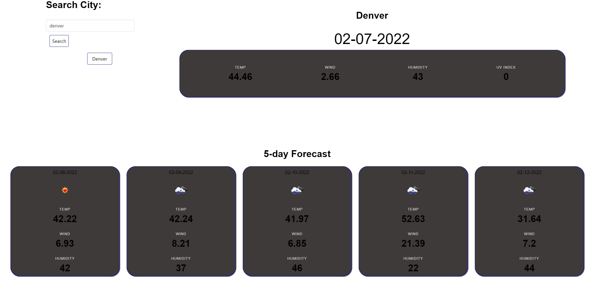

# 5 Day Weather Forecast App
## Description
The following site is a simple 5 day forecast weather app. It will keep the previous searches for you to easily switch back and forth between them. To view the live site please see the link below.
- https://dfaidley23.github.io/Weather-Forecast/

## Table of Contents
- [Usage](#usage)
- [Credits](#credits)

## Usage
Provide instructions and examples for use. Include screenshots as needed.
To add a screenshot, create an `assets/images` folder in your repository and upload your screenshot to it. Then, using the relative filepath, add it to your README using the following syntax:
    

    
## Credits
- MDN for its resources
- Stackoverflow for its forum base to help solve a few queries
- My tutor
- the DU staff
- My project team during our group session